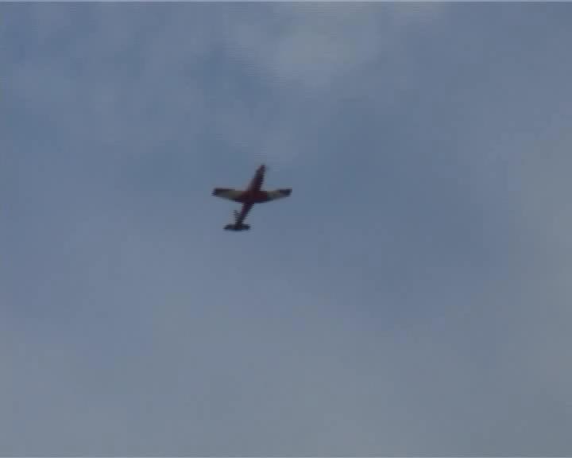

## Vision-based Real-Time Aerial Object Localization and Tracking for UAV Sensing System

[Yuanwei Wu*](https://ryancv.github.io), [Yao Sui+](http://www.suiyao.me/), and [Guanghui Wang*](http://www.ittc.ku.edu/~ghwang/)

* The University of Kansas, + Harvard Medical School

In IEEE Access 2017

[PDF](http://ieeexplore.ieee.org/stamp/stamp.jsp?tp=&arnumber=8080161)      [Bibtex](Wu_IEEE_Access_2017.txt)      [Github](https://github.com/RyanCV/Vision-based-OLT)

### Abstract

The paper focuses on the problem of vision-based obstacle detection and tracking for unmanned aerial vehicle navigation. A real-time object localization and tracking strategy from monocular image sequences is developed by effectively integrating the object detection and tracking into a dynamic Kalman model. At the detection stage, the object of interest is automatically detected and localized from a saliency map computed via the image background connectivity cue at each frame; at the tracking stage, a Kalman filter is employed to provide a coarse prediction of the object state, which is further refined via a local detector incorporating the saliency map and the temporal information between two consecutive frames. Compared to existing methods, the proposed approach does not require any manual initialization for tracking, runs much faster than the state-of-the-art trackers of its kind, and achieves competitive tracking performance on a large number of image sequences. Extensive experiments demonstrate the effectiveness and superior performance of the proposed approach.

### Video Demo

 

 

  1st Column                     | 2nd Column                | 3rd Column                | 4th Column      
  :--------------------:         | :--------------------:    | :--------------------:    | :--------------------:
  Aircraft                       | airplane_001              | big_2                     | airplane_011

 

  1st Column                     | 2nd Column                | 3rd Column                     
  :--------------------:         | :--------------------:    | :--------------------:        
  airplane_006                   | airplane_016              | Skyjumping_ce                    

### Download

Our code is available on [GitHub](https://github.com/RyanCV/Vision-based-OLT), and the dataset is available on [Google drive](https://drive.google.com/open?id=10pe0fdDeKo4ooflTg6wweXG9hKMV3yEp).

### Acknowledgement

This work was supported in part by the National Aeronautics and Space Administration LEARN II Program under Grant NNX15AN94N, in part by the General Research Fund of the University of Kansas under Grant 2228901, and in part by the Kansas NASA EPSCoR Program under Grant KNEP-PDG-10-2017-KU.

Copyright &copy; 2017 The University of Kansas

